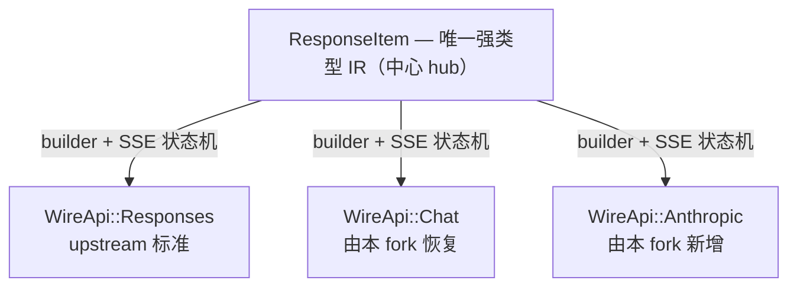

> English version: [README.md](README.md)
<!-- synced-with: README.md @ a7f58f1c1e（票 21 增强版基线；英文先改、中文随后同步） -->

<p align="center"><strong>Codex CLI</strong> 是 OpenAI 推出、运行在你本地计算机上的编码智能体。
<p align="center">
  
</p>
</br>如果你想在代码编辑器（VS Code、Cursor、Windsurf）里使用 Codex，请<a href="https://developers.openai.com/codex/ide">安装 IDE 插件。</a>
</br>如果你想要桌面应用的体验，请运行 <code>codex app</code>，或访问 <a href="https://chatgpt.com/codex?app-landing-page=true">Codex App 页面</a>。
</br>如果你在找 OpenAI 的<em>云端智能体</em> <strong>Codex Web</strong>，请前往 <a href="https://chatgpt.com/codex">chatgpt.com/codex</a>。</p>

---

## 本 fork 简介（tri-wire-api）

这是 `openai/codex` 的一个 fork：在单一内部表示（IR，internal representation）之上，恢复并原生实现了**三条出站协议线（wire）**：

- **Responses**（`/v1/responses`）——upstream 目前唯一保留的 wire。
- **Chat Completions**（`/v1/chat/completions`）——upstream 已于 2026 年 2 月移除（PR #10157）；本 fork 将其恢复为一等协议。
- **Anthropic Messages**（`/v1/messages`）——Claude 原生协议，完整支持扩展思考链（extended-thinking chain：`thinking_delta` / `signature_delta` SSE 帧、`budget_tokens` 钳制、`cache_control` ephemeral 断点、以及 `thinking` 块连同签名原样回传）。

**心智模型（这个 fork 为什么长成这样）：**

1. **单一 IR，三根辐条。** 所有 wire 共享 `ResponseItem` 作为唯一内部表示——是中心-辐条式（hub-and-spoke），不是逐对（pairwise）转换。复杂度保持 O(N)，而非 O(N²)。
2. **最小 fork 接缝（seam）。** 与 upstream 的分歧被收敛到约三个注册点（三注册点）：`WireApi`、`ModelProviderInfo`，以及 `core/src/client.rs` 中按 wire 的派发。upstream 至今只定义 `WireApi::Responses`，因此我们的 chat/messages 变体永远不会与上游漂移相撞。
3. **goose 蓝本的 Anthropic 实现。** `codex-api/src/sse/messages.rs` 里的 Anthropic SSE 状态机以 goose（Block 的 Rust 智能体）的模式为蓝本，而不是手搓解析器。
4. **真实网关验证。** 每条 wire 都针对一个线上组合网关做过端到端测试（H1 联调档案）：工具调用、并行工具调用分组、`max_tokens` 命中信号、思考链往返。任何降级都是显式失败（fail-loud）而非静默吞掉——例如截断的 `tool_use` JSON 会以 `ApiError::Stream` 浮出，绝不伪造出一个 `{}`。
5. **逐 provider 调优。** 额外的 `anthropic_max_tokens`、`anthropic_thinking_budget`、`anthropic_prompt_caching` 三个 `Option<_>` 字段与 `anthropic_adaptive_thinking` 开关，让每个 provider 可单独启用相应能力，而不触碰全局默认。

Upstream 以 `upstream/main` 跟踪。本 fork 的本地 agent 文档（`docs/agents`、`docs/specs`、`PONYTAIL-DEBT.md` 等）**有意**不提交到这里——它们位于工作机上一个未跟踪的同级 `docs/` 目录，不会被推送。

### Fork 文档地图

到哪里读什么（只链接、不复制——每一层都是其内容的唯一权威来源）：

1. **[CONTEXT.md](CONTEXT.md)**——fork 的词汇权威：tri-wire 术语、用法/禁用用法配对、出处。给任何新事物命名之前先读它。
2. **[docs/adr/](docs/adr/)**——决策记录，append-only（[索引](docs/adr/README.md)）：0001 fork 基线与同步、0002 merge 裁决、0003 Gemini 裁决、0004 reasoning_content 透传、0005 reasoning_effort 翻译、0006 fork 分歧补丁队列。
3. **[AGENTS.md](AGENTS.md)**——面向 agent 的规则；“Fork delta: tri-wire-api”（fork 差异面）一节承载 fork 红线。嵌套链（就近文件优先）：[codex-rs/AGENTS.md](codex-rs/AGENTS.md) → [core/src/client/wire/AGENTS.md](codex-rs/core/src/client/wire/AGENTS.md) 存放 per-wire 协议红线。
4. **CI**：`.github/workflows/fork-health.yml` 是每日 fork 接缝（seam）看门狗（接缝 crate 的 clippy + wiremock 套件 + 漂移探针）；`fork-cli-test-release.yml` 跑三平台 check + release 构建。重型构建只在 CI 执行。
5. **版本控制**：以 [GitButler](https://gitbutler.com) 维护（虚拟分支，一票一个 lane）；upstream 同步一律 merge `upstream/main`，绝不 rebase（ADR-0001）。

### 使用三条 wire（Responses / Chat / Anthropic Messages）

`wire_api` 是**每个 provider 一条协议**——没有自动协商，也没有故障转移。要同时使用多条协议，就声明多个 provider（它们甚至可以指向同一个 base URL），每次运行用 `-p` 选一个：

```toml
# ~/.codex/config.toml

# default: upstream behaviour, one provider, one wire
model_provider = "openai"

# --- Responses wire (OpenAI native /v1/responses) ---
[model_providers.gw-resp]
name        = "gw-resp"
base_url    = "https://example.com/v1"   # note: path stays at /v1; the wire appends /responses, /chat/completions, or /messages itself
wire_api    = "responses"
env_key     = "MY_API_KEY"

# --- Chat Completions wire (OpenAI legacy, restored by this fork) ---
[model_providers.gw-chat]
name        = "gw-chat"
base_url    = "https://example.com/v1"
wire_api    = "chat"
env_key     = "MY_API_KEY"

# --- Anthropic Messages wire (/v1/messages) ---
[model_providers.gw-msg]
name        = "gw-msg"
base_url    = "https://example.com/v1"
wire_api    = "anthropic"
env_key     = "MY_API_KEY"

# optional anthropic-only knobs (per-provider; leave unset to use built-in defaults):
anthropic_max_tokens      = 128000   # output budget, otherwise a built-in default
anthropic_thinking_budget = 8192     # extended-thinking budget_tokens (clamped to 1024..max_tokens-1)
anthropic_prompt_caching  = true     # marks system prompt + last tool with cache_control: ephemeral
anthropic_adaptive_thinking = false # Claude 4.6+: adaptive track sends thinking:{type:adaptive} + output_config.effort instead of budget_tokens
```

然后每次调用时选择 wire 和模型：

```shell
codex -p gw-resp -m some-openai-model    "…"
codex -p gw-chat -m deepseekpro          "…"
codex -p gw-msg  -m claude-…             "…"   # thinking chain streams natively (TUI shows reasoning deltas)
```

行为说明：

- 对下游注入鉴权的网关，**`experimental_bearer_token = "PROXY_MANAGED"`**（或真实 token）也可以替代 `env_key`。
- 同一个物理网关端点承载全部三条 wire（`POST /v1/responses`、`POST /v1/chat/completions`、`POST /v1/messages`）——fork 从不裁剪或改写路径。
- 在 Anthropic wire 上，模型的 `thinking` 块连同 SSE `signature` 原样回传（Anthropic 的 tool-use 回合契约）；无签名的 reasoning 一律**丢弃**而非篡改。非 data-URI 图片会被显式丢弃。截断的工具调用 JSON 直接报错——绝不静默伪造。
- **`reasoning_effort`**（会话级）按 wire 翻译：Chat 发送顶层 `reasoning_effort`（可移植词汇 low/medium/high；`minimal`→`low`、`xhigh`/`max`→`high`）；Anthropic 按 `anthropic_adaptive_thinking` 分轨——adaptive 发 `output_config.effort`，manual 分桶到 `budget_tokens`（1024/2048/4096，钳制）。翻译是纯函数且确定性的（cache-key 稳定）——见 [docs/adr/0005](docs/adr/0005-reasoning-effort-translation.md)。
- 一个 turn 永远只跑在一条 wire 上；中途换 wire 意味着用 `-p` 开一个新 turn。

### 本地开发与云端 CI

**本地机器只做轻量开发——一切重型构建、检查与发布都在 GitHub Actions 上跑。** 本地只需要 Rust 工具链（由 `codex-rs/rust-toolchain.toml` 钉死在 `1.95.0`）与 `just` 来快速跑 `fmt`/`clippy`/`test`。`fork-cli-test-release` 工作流（手动 `workflow_dispatch` 触发）执行 `check` job（fmt + clippy + fork 范围测试）与 release 的 `build` job，覆盖 Windows、macOS、Linux，然后发布滚动预发布版——因此本地 `codex-rs/target/` 只是一个可丢弃的磁盘缓存：删掉它能回收约 110G 磁盘。

## 本 fork 为何存在

Codex 模型家族自发布起就被官方文档标注为 Responses-only，例外在数波退役中清零：`codex-mini-latest` 于 2026-02-12 从 API 移除，其余 Codex API 模型（`gpt-5-codex` 至 `gpt-5.2-codex`）于 2026-07-23 关停，2026-08-04 最后一个被过渡期接受在 `/v1/chat/completions` 端点的 `gpt-5.3-codex` 也被从该端点撤下。LiteLLM Proxy 的 bridge 路由里残留一条通配（wildcard）路由，仍把该模型指向已移除的端点，于是约 4 小时内经它转发的每个请求都返回 404——热修复上线前累计 1,700+ 失败请求（LiteLLM issue #35879；02-12 与 07-23 两波见 OpenAI Deprecations 页）。模型没有错，客户端也没有错：故障发生在一个由第三方运维、客户端被动依赖的*服务端协议桥（protocol bridge）*里。

一个 chat-wire 客户端只要拒绝把协议翻译外包给别人的路由器，就能绕开这一整类故障。本 fork 把全部三条 wire——Responses、Chat Completions、Anthropic Messages——原生内置进客户端本身，由一个本地配置键（`wire_api`）选定。没有可断的桥、没有会错路的通配、没有要等上游的热修：翻译就活在你运行的二进制里，由 fork 接缝 CI 端到端看护。

## 何时用本 fork，何时用 upstream

| 你的场景 | 选择 |
|---|---|
| 你只说 OpenAI Responses（`/v1/responses`），配合 Codex app 使用 | **upstream `openai/codex`**——本 fork 对你没有增量 |
| 你需要 Responses / Chat Completions / Anthropic Messages 的任意组合（不支持 `/v1/responses` 的网关：LM Studio、Ollama pre-responses、DeepSeek 式 chat 端点） | **本 fork**——一个二进制、一份配置、三种协议 |
| 非 Codex 客户端，需要单个端点背后接多个 provider | **LiteLLM Proxy / Portkey**——那种形态该用独立网关；本 fork 是进程内的 wire 层，不是代理 |
| Anthropic Messages 直连，包括扩展思考链（签名原样回传、`budget_tokens`、`cache_control`） | **本 fork**——goose 蓝本的 SSE 状态机，真实网关验证 |

## 架构一览

本 fork 是中心-辐条式（hub-and-spoke），不是逐对转换：唯一强类型内部表示（IR）`ResponseItem` 居中，每条 wire 是一根辐条——一个请求 builder 加一个入站 SSE 状态机（即 per-wire 模块：每条 wire 一对模块）。因此新增一条协议的成本是 O(N)，而非逐对翻译的 O(N²)。与 upstream 的分歧（fork delta）被约束在恰好三个注册点：`WireApi`、`ModelProviderInfo.wire_api`，以及 `client.rs` 中的派发 match。



## 如何新增第 4 条 wire

一条新的出站协议（比如 Gemini）走的就是产出 Chat 与 Anthropic 的同一套蓝本。约束性规则见 [wire/AGENTS.md](codex-rs/core/src/client/wire/AGENTS.md) 红线 1–2——新协议意味着一个新模块文件加三个注册点全部注册，且必须遵循 `chat.rs` 的形状（builder + 流式循环放模块里，`client.rs` 只留派发）。具体五步：

1. **新增模块对。** 出站请求 builder + 流式循环放 `codex-rs/core/src/client/wire/<new>.rs`；入站 SSE 状态机放 `codex-api/src/sse/<new>.rs`。
2. **三注册点一起改。** 在 `model-provider-info/src/lib.rs` 添加 `WireApi` 变体及其 `wire_api` 配置面，外加 `ModelClientSession::stream`（`core/src/client.rs`）中的派发分支。
3. **新增 wiremock fixture。** 为新辐条在接缝测试套件里加回放 fixture 与往返测试，并登记进 cross-wire 表，让 `fork-health.yml` 从第一天起看护它。
4. **新增词汇条目。** 合码之前，把新术语连同用法/禁用用法配对写进 [CONTEXT.md](CONTEXT.md)——fork 的词汇权威。
5. **记录决策。** 在 [docs/adr/](docs/adr/) 下写一篇 ADR，并按 [ADR-0006](docs/adr/0006-fork-divergence-patch-queue.md) 在语义补丁队列（FORK_DIVERGENCE）登记条目：分类 + merge-base 锚点。

---

## 快速开始

### 安装与运行 Codex CLI

在 Mac 或 Linux 上运行以下命令安装 Codex CLI：

```shell
curl -fsSL https://chatgpt.com/codex/install.sh | sh
```

在 Windows 上运行以下命令安装 Codex CLI：

```shell
powershell -ExecutionPolicy ByPass -c "irm https://chatgpt.com/codex/install.ps1 | iex"
```

独立安装器默认从 `https://releases.openai.com/codex` 下载；当元数据或资产下载不可用时回退到 GitHub Releases。要强制使用 GitHub Releases，把 `CODEX_INSTALLER_USE_RELEASES_OPENAI_COM` 设为 `false`（`0` 与 `no` 亦可）：

```shell
curl -fsSL https://chatgpt.com/codex/install.sh | CODEX_INSTALLER_USE_RELEASES_OPENAI_COM=false sh
```

```powershell
$env:CODEX_INSTALLER_USE_RELEASES_OPENAI_COM='false'; irm https://chatgpt.com/codex/install.ps1 | iex
```

Codex CLI 也可以通过以下包管理器安装：

```shell
# Install using npm
npm install -g @openai/codex
```

```shell
# Install using Homebrew
brew install --cask codex
```

装好后直接运行 `codex` 即可开始。

<details>
<summary>你也可以到 <a href="https://github.com/openai/codex/releases/latest">最新 GitHub Release</a> 下载与你平台匹配的 binary。</summary>

每个 GitHub Release 包含许多可执行文件，但实践中你多半只需要下面之一：

- macOS
  - Apple Silicon/arm64：`codex-aarch64-apple-darwin.tar.gz`
  - x86_64（较旧的 Mac 硬件）：`codex-x86_64-apple-darwin.tar.gz`
- Linux
  - x86_64：`codex-x86_64-unknown-linux-musl.tar.gz`
  - arm64：`codex-aarch64-unknown-linux-musl.tar.gz`

每个压缩包只含一个条目，平台名固化在文件名里（例如 `codex-x86_64-unknown-linux-musl`），解压后你多半需要把它重命名为 `codex`。

</details>

### 在你的 ChatGPT 订阅中使用 Codex

运行 `codex` 并选择 **Sign in with ChatGPT**。我们推荐登录 ChatGPT 账号，把 Codex 作为你 Plus、Pro、Business、Edu 或 Enterprise 订阅的一部分来使用。[了解你的 ChatGPT 订阅包含哪些权益](https://help.openai.com/en/articles/11369540-codex-in-chatgpt)。

你也可以用 API key 使用 Codex，但这需要[额外配置](https://developers.openai.com/codex/auth#sign-in-with-an-api-key)。

### 让 Codex Desktop app 使用本 fork 的内核（Windows）

Codex Desktop app 支持通过 `CODEX_CLI_PATH` 用户环境变量指定不同的 CLI 引擎——
这就是把 app 内核换成 fork 构建产物的官方机制，无需改动 app 安装：

```powershell
setx CODEX_CLI_PATH "D:\path\to\codex.exe"
```

设置后需完整重启 app（变量在引擎拉起时读取）。回滚：删除该变量（`reg delete
"HKCU\Environment" /v CODEX_CLI_PATH /f`，或系统属性 → 环境变量）并再次重启 app。
本 fork 的发行包正是为这条工作流构建的——见 Releases 页。

## 文档

- [**Codex 文档**](https://developers.openai.com/codex)
- [**参与贡献**](./docs/contributing.md)
- [**安装与构建**](./docs/install.md)
- [**开源基金**](./docs/open-source-fund.md)

本仓库采用 [Apache-2.0 许可证](LICENSE)。
