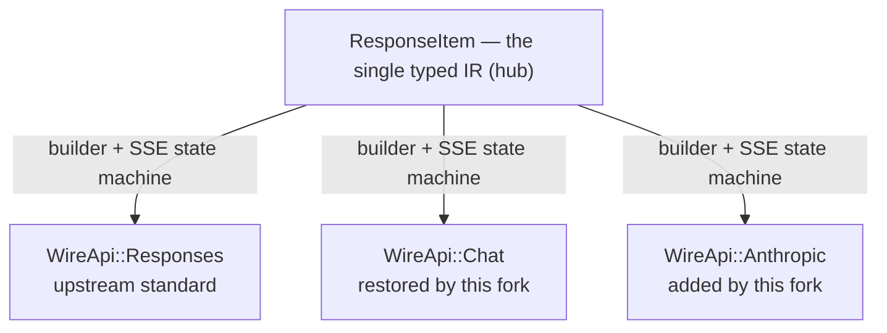

> 中文版本：[README-ZH.md](README-ZH.md)

<p align="center"><strong>Codex CLI</strong> is a coding agent from OpenAI that runs locally on your computer.
<p align="center">
  
</p>
</br>
If you want Codex in your code editor (VS Code, Cursor, Windsurf), <a href="https://developers.openai.com/codex/ide">install in your IDE.</a>
</br>If you want the desktop app experience, run <code>codex app</code> or visit <a href="https://chatgpt.com/codex?app-landing-page=true">the Codex App page</a>.
</br>If you are looking for the <em>cloud-based agent</em> from OpenAI, <strong>Codex Web</strong>, go to <a href="https://chatgpt.com/codex">chatgpt.com/codex</a>.</p>

---

## About this fork (tri-wire-api)

This is a fork of `openai/codex` that restores and natively implements **three outbound wire protocols** on a single internal representation:

- **Responses** (`/v1/responses`) — upstream's only remaining wire.
- **Chat Completions** (`/v1/chat/completions`) — removed by upstream in Feb 2026 (PR #10157); reintroduced here as a first-class protocol.
- **Anthropic Messages** (`/v1/messages`) — Claude-native, including the extended-thinking chain (`thinking_delta` / `signature_delta` SSE frames, `budget_tokens` clamping, `cache_control` ephemeral breakpoints, and verbatim signature-preserving replay of `thinking` blocks).

**Mental model (why the fork is shaped this way):**

1. **One IR, three spokes.** All wires share `ResponseItem` as the single internal representation (hub-and-spoke, not pairwise translation). Complexity stays O(N) instead of O(N²).
2. **Minimal fork seam.** The divergence from upstream is contained to ~3 registration points: `WireApi`, `ModelProviderInfo`, and a per-wire dispatch in `core/src/client.rs`. Upstream still only defines `WireApi::Responses`, so our chat/messages variants never collide with upstream drift.
3. **goose-blueprint Anthropic implementation.** The Anthropic SSE state machine in `codex-api/src/sse/messages.rs` is modeled on goose's pattern (Block's Rust agent), not a hand-rolled parser.
4. **Real-gateway verified.** Every wire was tested end-to-end against a live combo gateway (H1 联调档案）：tool calls, parallel tool-call grouping, `max_tokens` hit signaling, and thinking-chain round trips. Any degradation is fail-loud, not silent — e.g., truncated `tool_use` JSON surfaces as `ApiError::Stream`, never a fabricated `{}`.
5. **Per-provider tuning.** Additional `anthropic_max_tokens`, `anthropic_thinking_budget`, `anthropic_prompt_caching` `Option<_>` fields plus the `anthropic_adaptive_thinking` flag let each provider opt in without touching global defaults.

Upstream is tracked as `upstream/main`. This fork's local agent docs (`docs/agents`, `docs/specs`, `PONYTAIL-DEBT.md`, etc.) are intentionally **not** committed here — they live in an untracked sibling `docs/` directory on the working machine and are not pushed.

### Fork documentation map

Where to read what (link, don't copy — each layer stays the single source for its content):

1. **[CONTEXT.md](CONTEXT.md)** — the fork's vocabulary authority: tri-wire terms, usage/prohibited-usage pairs, sources. Read it before naming anything new.
2. **[docs/adr/](docs/adr/)** — decision records, append-only ([index](docs/adr/README.md)): 0001 fork baseline & sync, 0002 merge rulings, 0003 Gemini verdict, 0004 reasoning_content passthrough, 0005 reasoning_effort translation, 0006 fork divergence patch queue.
3. **[AGENTS.md](AGENTS.md)** — agent-facing rules; the "Fork delta: tri-wire-api" section holds the fork red lines. Nested chain (nearest file wins): [codex-rs/AGENTS.md](codex-rs/AGENTS.md) → [core/src/client/wire/AGENTS.md](codex-rs/core/src/client/wire/AGENTS.md) for the per-wire protocol red lines.
4. **CI**: `.github/workflows/fork-health.yml` is the daily fork-seam watchdog (seam-crate clippy + wiremock suites + drift probe); `fork-cli-test-release.yml` runs the three-platform check + release build. Heavy builds run in CI only.
5. **Version control**: maintained with [GitButler](https://gitbutler.com) (virtual branches, one lane per ticket); upstream sync merges `upstream/main` and never rebases (ADR-0001).

### Using the three wires (Responses / Chat / Anthropic Messages)

`wire_api` is **one protocol per provider** — there is no auto-negotiation and no failover. To use several protocols at once you declare multiple providers (they can even point at the same base URL) and pick one per run with `-p`:

```toml
# ~/.codex/config.toml

# default: upstream behaviour, one provider, one wire
model_provider = "openai"

# --- Responses wire (OpenAI native /v1/responses) ---
[model_providers.gw-resp]
name        = "gw-resp"
base_url    = "https://example.com/v1"   # note: path stays at /v1; the wire appends /responses, /chat/completions, or /messages itself
wire_api    = "responses"
env_key     = "MY_API_KEY"

# --- Chat Completions wire (OpenAI legacy, restored by this fork) ---
[model_providers.gw-chat]
name        = "gw-chat"
base_url    = "https://example.com/v1"
wire_api    = "chat"
env_key     = "MY_API_KEY"

# --- Anthropic Messages wire (/v1/messages) ---
[model_providers.gw-msg]
name        = "gw-msg"
base_url    = "https://example.com/v1"
wire_api    = "anthropic"
env_key     = "MY_API_KEY"

# optional anthropic-only knobs (per-provider; leave unset to use built-in defaults):
anthropic_max_tokens      = 128000   # output budget, otherwise a built-in default
anthropic_thinking_budget = 8192     # extended-thinking budget_tokens (clamped to 1024..max_tokens-1)
anthropic_prompt_caching  = true     # marks system prompt + last tool with cache_control: ephemeral
anthropic_adaptive_thinking = false # Claude 4.6+: adaptive track sends thinking:{type:adaptive} + output_config.effort instead of budget_tokens
```

Then select a wire and model per invocation:

```shell
codex -p gw-resp -m some-openai-model    "…"
codex -p gw-chat -m deepseekpro          "…"
codex -p gw-msg  -m claude-…             "…"   # thinking chain streams natively (TUI shows reasoning deltas)
```

Behaviour notes:

- **`experimental_bearer_token = "PROXY_MANAGED"`** (or a real token) also works in place of `env_key` for gateways that inject auth downstream.
- The same physical gateway endpoints strike all three wires (`POST /v1/responses`, `POST /v1/chat/completions`, `POST /v1/messages`) — fork never strips or rewrites paths.
- On the Anthropic wire, replay of the model's `thinking` blocks is done verbatim with the SSE `signature` (anthropic's tool-use round contract); unsigned reasonings are **dropped** rather than altered. Non-data-URI images are dropped loudly. Truncated tool-call JSON errors out — never silently fabricated.
- **`reasoning_effort`** (session-level) translates per wire: Chat sends top-level `reasoning_effort` (portable vocabulary low/medium/high; `minimal`→`low`, `xhigh`/`max`→`high`); Anthropic routes by `anthropic_adaptive_thinking` — adaptive sends `output_config.effort`, manual buckets to `budget_tokens` (1024/2048/4096, clamped). Translation is pure and deterministic (cache-key stable) — see [docs/adr/0005](docs/adr/0005-reasoning-effort-translation.md).
- A turn always runs on exactly one wire; switching wires mid-thread means starting a new turn with `-p`.

### Local dev vs. cloud CI

**Local machines only keep lightweight development — every heavy build, check, and release runs in GitHub Actions.** Locally you only need the Rust toolchain (pinned to `1.95.0` by `codex-rs/rust-toolchain.toml`) and `just` for quick `fmt`/`clippy`/`test` runs. The `fork-cli-test-release` workflow (triggered manually with `workflow_dispatch`) runs the `check` job (fmt + clippy + fork-scoped tests) and the release `build` job across Windows, macOS, and Linux, then publishes the rolling prerelease — so a local `codex-rs/target/` is just a disposable on-disk cache: delete it to reclaim ~110G of disk.

## Why this fork exists

The Codex model family was documented as Responses-only from the start, and OpenAI retired the exceptions in waves: `codex-mini-latest` left the API on 2026-02-12, the remaining Codex API models (`gpt-5-codex` through `gpt-5.2-codex`) were shut down on 2026-07-23, and on 2026-08-04 `gpt-5.3-codex` — the last model OpenAI had still transitionally accepted on the `/v1/chat/completions` endpoint — was pulled from it too. LiteLLM Proxy’s bridge router kept a wildcard route that still mapped that model to the removed endpoint, and for roughly 4 hours every request through it came back 404 — 1,700+ failed requests before the hotfix (LiteLLM issue #35879; OpenAI Deprecations page for the 02-12 and 07-23 waves). Nothing was wrong with the models or the clients: the outage lived inside a *server-side protocol bridge* that a third party operated and that clients passively depended on.

A chat-wire client can avoid that entire failure class by refusing to delegate protocol translation to somebody else’s router. This fork builds all three wires — Responses, Chat Completions, Anthropic Messages — natively into the client itself, selected by one local config key (`wire_api`). There is no bridge to break, no wildcard to misroute, and no upstream hotfix to wait for: the translation lives in the binary you run, guarded end-to-end by the fork-seam CI.

## When to use this fork vs upstream

| Your situation | Use |
|---|---|
| You only ever speak OpenAI Responses (`/v1/responses`) with the Codex app | **upstream `openai/codex`** — this fork adds nothing you need |
| You need any combination of Responses / Chat Completions / Anthropic Messages (gateways that don’t implement `/v1/responses`: LM Studio, Ollama pre-responses, DeepSeek-style chat endpoints) | **this fork** — one binary, one config, three protocols |
| Non-Codex clients that need many providers behind one endpoint | **LiteLLM Proxy / Portkey** — a standalone gateway is the right shape there; this fork is an in-process wire layer, not a proxy |
| Anthropic Messages direct, including the extended-thinking chain (verbatim signature replay, `budget_tokens`, `cache_control`) | **this fork** — goose-blueprint SSE state machine, real-gateway verified |

## Architecture at a glance

The fork is hub-and-spoke, not pairwise: one single typed internal representation (IR), `ResponseItem`, sits in the middle, and every wire is one spoke — a request builder plus an inbound SSE state machine. Adding a protocol therefore costs O(N), not the O(N²) of pairwise translation. The divergence from upstream is contained to exactly three registration points (`WireApi`, `ModelProviderInfo.wire_api`, and the dispatch match in `client.rs`).



## How to add a 4th wire

A new outbound protocol (say Gemini) follows the same blueprint that produced Chat and Anthropic. The binding rules are red lines 1–2 of [wire/AGENTS.md](codex-rs/core/src/client/wire/AGENTS.md) — a new protocol means a new module file plus registration at all three points, and it must follow the `chat.rs` shape (builder + streaming loop in the module, dispatch only in `client.rs`). Concretely, in five steps:

1. **Add the module pair.** Outbound request builder + streaming loop in `codex-rs/core/src/client/wire/<new>.rs`; inbound SSE state machine in `codex-api/src/sse/<new>.rs`.
2. **Update the three registration points together.** The `WireApi` variant and its `wire_api` config surface in `model-provider-info/src/lib.rs`, plus the dispatch branch in `ModelClientSession::stream` (`core/src/client.rs`).
3. **Add wiremock fixtures.** Replay fixtures + round-trip tests for the new spoke in the seam suites, and register it in the cross-wire table, so `fork-health.yml` guards it from day one.
4. **Add the vocabulary.** New terms go into [CONTEXT.md](CONTEXT.md) — the fork’s vocabulary authority — with usage and prohibited-usage pairs, before the code merges.
5. **Record the decision.** An ADR under [docs/adr/](docs/adr/), plus an entry in the semantic patch queue (FORK_DIVERGENCE) with its classification and merge-base anchor, per [ADR-0006](docs/adr/0006-fork-divergence-patch-queue.md).

---

## Quickstart

### Installing and running Codex CLI

Run the following on Mac or Linux to install Codex CLI:

```shell
curl -fsSL https://chatgpt.com/codex/install.sh | sh
```

Run the following on Windows to install Codex CLI:

```shell
powershell -ExecutionPolicy ByPass -c "irm https://chatgpt.com/codex/install.ps1 | iex"
```

The standalone installers download from `https://releases.openai.com/codex` by default and fall back to GitHub Releases if a metadata or asset download is unavailable. To force GitHub Releases, set `CODEX_INSTALLER_USE_RELEASES_OPENAI_COM` to `false` (`0` and `no` are also accepted):

```shell
curl -fsSL https://chatgpt.com/codex/install.sh | CODEX_INSTALLER_USE_RELEASES_OPENAI_COM=false sh
```

```powershell
$env:CODEX_INSTALLER_USE_RELEASES_OPENAI_COM='false'; irm https://chatgpt.com/codex/install.ps1 | iex
```

Codex CLI can also be installed via the following package managers:

```shell
# Install using npm
npm install -g @openai/codex
```

```shell
# Install using Homebrew
brew install --cask codex
```

Then simply run `codex` to get started.

<details>
<summary>You can also go to the <a href="https://github.com/openai/codex/releases/latest">latest GitHub Release</a> and download the appropriate binary for your platform.</summary>

Each GitHub Release contains many executables, but in practice, you likely want one of these:

- macOS
  - Apple Silicon/arm64: `codex-aarch64-apple-darwin.tar.gz`
  - x86_64 (older Mac hardware): `codex-x86_64-apple-darwin.tar.gz`
- Linux
  - x86_64: `codex-x86_64-unknown-linux-musl.tar.gz`
  - arm64: `codex-aarch64-unknown-linux-musl.tar.gz`

Each archive contains a single entry with the platform baked into the name (e.g., `codex-x86_64-unknown-linux-musl`), so you likely want to rename it to `codex` after extracting it.

</details>

### Using Codex with your ChatGPT plan

Run `codex` and select **Sign in with ChatGPT**. We recommend signing into your ChatGPT account to use Codex as part of your Plus, Pro, Business, Edu, or Enterprise plan. [Learn more about what's included in your ChatGPT plan](https://help.openai.com/en/articles/11369540-codex-in-chatgpt).

You can also use Codex with an API key, but this requires [additional setup](https://developers.openai.com/codex/auth#sign-in-with-an-api-key).

### Pointing the Codex Desktop app at this fork’s binary (Windows)

The Codex Desktop app can run a different CLI engine through the `CODEX_CLI_PATH`
user environment variable — this is how you swap the app’s kernel for a fork build
without touching the app install:

```powershell
setx CODEX_CLI_PATH "D:\path\to\codex.exe"
```

Fully restart the app afterwards (the variable is read at engine spawn time).
To roll back, clear the variable (`reg delete "HKCU\Environment" /v CODEX_CLI_PATH /f`
or System Properties → Environment Variables) and restart the app again. This fork’s
release packages are built for exactly this workflow — see the Releases page.

## Docs

- [**Codex Documentation**](https://developers.openai.com/codex)
- [**Contributing**](./docs/contributing.md)
- [**Installing & building**](./docs/install.md)
- [**Open source fund**](./docs/open-source-fund.md)

This repository is licensed under the [Apache-2.0 License](LICENSE).
